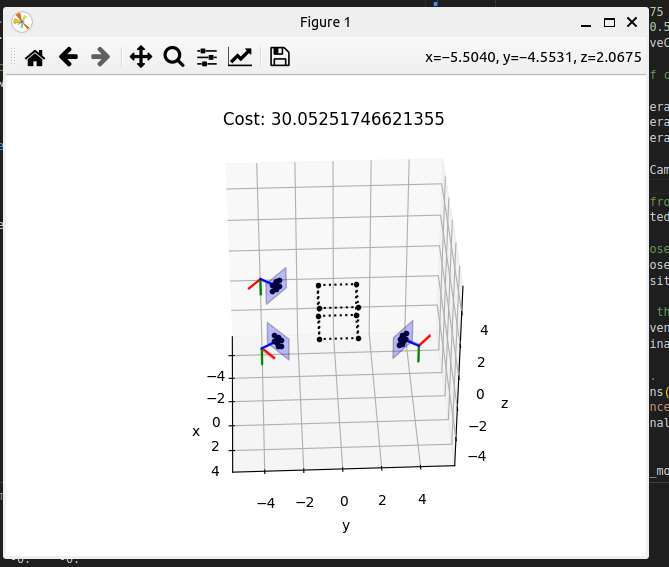
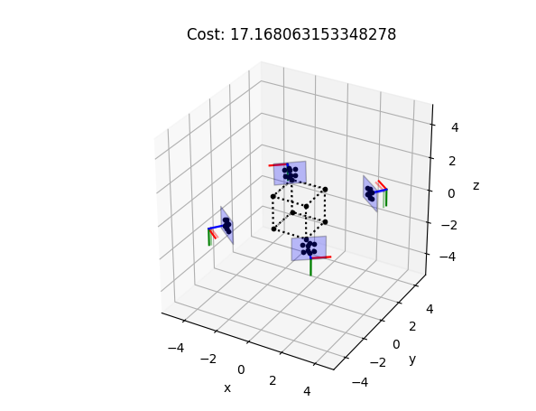

# Lab 5 - Indirect tracking
Welcome to Lab 5!

We will here experiment with bundle adjustment:
- [ex_1_motion_only_ba.py](ex_1_motion_only_ba.py)
- [ex_2_multicamera_motion_only_ba.py](ex_2_multicamera_motion_only_ba.py)
- [ex_3_structure_only_ba.py](ex_3_structure_only_ba.py)
- [ex_4_full_ba.py](ex_4_full_ba.py)

You can install all dependencies using `pip`:
```bash
pip install -r requirements.txt
```

## Example 1 - Motion-only Bundle Adjustment
In the first example, we will estimate the pose of a camera using motion-only bundle adjustment.

### Understand the code
- Study and try to understand the functionality of `PerspectiveCamera` in [camera.py](camera.py)
- As in the lectures, I have chosen to represent the camera measurements precalibrated on the normalised image plane.
  In the motion-only case, the world points are fixed, and the camera pose is the state variable we want to estimate.
  Study how I have represented this kind of measurement in `PrecalibratedCameraMeasurementsFixedWorld` in
  [measurements.py](measurements.py).
  Notice how I have propagated the uncertainty from pixels to normalised image coordinates.
- Study the implementation of the motion-only objective function in `PrecalibratedMotionOnlyBAObjective`
  in [ex_1_motion_only_ba.py](ex_1_motion_only_ba.py).
  Compare this with the overview in the lecture.
- See how the code is used to estimate camera pose in `main()` in [ex_1_motion_only_ba.py](ex_1_motion_only_ba.py).

### Suggested experiments
- Run the code in [ex_1_motion_only_ba.py](ex_1_motion_only_ba.py)
Nice

- Try changing the uncertainty in the pixel measurements
More uncertainty and higher cost

- Try changing the camera geometry
Takes longer to converge with higher focal length


## Example 2 - Multicamera motion-only Bundle Adjustment
In structure-only and full bundle adjustment, we will use measurements from two or more cameras.
As a first step in this development, how can we add more cameras in the motion-only bundle adjustment procedure?
If you want, try to implement this yourself based on the first example (using the first point below as a hint,
and `visualise_multicam_moba()` in  [visualise_ba.py](visualise_ba.py)).

### Understanding the code
- The task is now to estimate the pose of several cameras simultaneously, 
  which means that we need to optimise over several state variables.
  Similarly to how this was represented in the lectures, I have made a composition of state variables in
  `CompositeStateVariable` in [optim.py](optim.py).
  Try to understand how this is meant to work.
- Compare with the previous example, and notice the changes made in the objective and main-function in 
  [ex_2_multicamera_motion_only_ba.py](ex_2_multicamera_motion_only_ba.py) to allow for more cameras.

### Suggested experiments
- Run the code in [ex_2_multicamera_motion_only_ba.py](ex_2_multicamera_motion_only_ba.py)
Nice. 

- Try adding more cameras!
Added another camera, and it worked well.



## Example 3 - Structure-only Bundle Adjustment
We will now let the camera poses be fixed, and instead try to estimate the position of the world points
given camera measurements.
Feel free to try to implement this yourself.

### Understanding the code
- Compare `PrecalibratedCameraMeasurementsFixedCamera` with the previous measurement type in
  [measurements.py](measurements.py).
- Study the implementation of the structure-only objective function and main-function
  in [ex_3_structure_only_ba.py](ex_3_structure_only_ba.py).
  
### Suggested experiments
- Run the code in [ex_3_structure_only_ba.py](ex_3_structure_only_ba.py)
- Try moving the cameras closer together.

  How does this influence the results?
  The points are closer together, and the cost is lower. In the extreme I sent the cameras 6 times the length further out. The cost was higher, and the points not that close to the real points.

  

## Example 4 - Full Bundle Adjustment
Now, its time to estimate both camera poses as well as world points.
Again, feel free to implement this yourself based on the previous examples.

### Understanding the code
- To help me out with remembering which variables are which,
  I have made a subclass of `CompositeStateVariable` called `BundleAdjustmentState` in [optim.py](optim.py).
- Notice how the objective in [ex_4_full_ba.py](ex_4_full_ba.py) in a way combines the objectives in
  motion-only and structure-only BA.
- Take a look at how I have implemented the priors we need to define the coordinate frame and scale.

### Suggested experiments
- Run the code in [ex_4_full_ba.py](ex_4_full_ba.py)
- Try adding more cameras



- Try implementing a prior on the distance between two points, rather than a point prior (see the lecture)

  Added prior of the distance between two points instead.
  
  By this 
  
